Bayesian growth models
================
Santiago Bianchi

#### PACKAGES

``` r
library(bayesian)
library(tidyverse)
library(BayesGrowth)
library(AquaticLifeHistory)
library(tidybayes)
library(bayesplot)
library(rstan)
library(pander)
library(cowplot)
library(readxl)
library(plotrix)
library(readr)
```

#### DATA

``` r
## MALES ##

mac <- read.table("data/machos.txt", header = T)
View(mac)

summary(mac)
```

    ##       Age            Lenght     
    ##  Min.   : 2.00   Min.   :391.0  
    ##  1st Qu.: 5.00   1st Qu.:493.5  
    ##  Median : 8.00   Median :621.0  
    ##  Mean   : 9.06   Mean   :642.1  
    ##  3rd Qu.:12.38   3rd Qu.:774.8  
    ##  Max.   :21.50   Max.   :956.0

## MALE´S PRIORS

``` r
#prior L0
mean(c(190,180,228)) #199.33
```

    ## [1] 199.3333

``` r
seL0<-sd(c(190,180,228))/sqrt(length(c(190,180,228))) #14.62
seL0
```

    ## [1] 14.62114

``` r
#prior Linf
mean(c(1340,1190,1150)) #1227
```

    ## [1] 1226.667

``` r
seLinf<-sd(c(1340,1190,1150))/sqrt(length(c(1340,1190,1150))) #57.83
seLinf
```

    ## [1] 57.83117

## MALE´S GROWTH MODELS

``` r
#von Bertalanffy
modelo_macVB<- Estimate_MCMC_Growth(mac,Model = "VB" ,iter = 10000,n.chains = 4,BurnIn = 5000,thin = 1,Linf = 1227,Linf.se = 57.83,
                                    L0 = 199.33,L0.se = 14.62,sigma.max = 300,verbose = T,n_cores = 3,k.max = 0.7)
```

    ## 
    ## CHECKING DATA AND PREPROCESSING FOR MODEL 'VB_stan_model' NOW.
    ## 
    ## COMPILING MODEL 'VB_stan_model' NOW.
    ## 
    ## STARTING SAMPLER FOR MODEL 'VB_stan_model' NOW.

``` r
pander(Get_MCMC_parameters(modelo_macVB))
```

| Parameter | mean  | se_mean |  sd   | 2.5%  |  50%  | 97.5% | n_eff | Rhat |
|:---------:|:-----:|:-------:|:-----:|:-----:|:-----:|:-----:|:-----:|:----:|
|   Linf    | 1181  |  0.57   | 59.38 | 1062  | 1180  | 1297  | 10826 |  1   |
|     k     | 0.07  |    0    | 0.01  | 0.05  | 0.07  | 0.09  | 10369 |  1   |
|    L0     | 212.4 |  0.12   | 14.24 | 184.3 | 212.5 | 240.4 | 14106 |  1   |
|   sigma   | 133.9 |  0.11   | 13.05 | 111.2 | 133.1 | 162.4 | 13518 |  1   |

``` r
mcmc_combo(modelo_macVB,pars = c("Linf", "k", "L0", "sigma")) #diagnostics
```

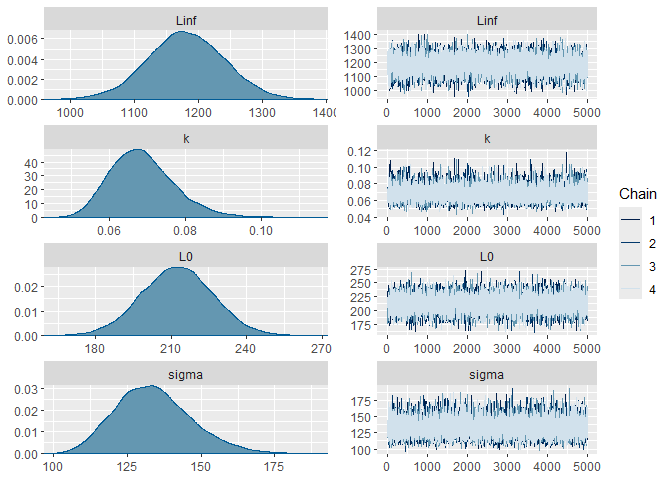<!-- -->

``` r
mcmc_acf(modelo_macVB,pars = c("Linf", "k", "L0", "sigma"))
```

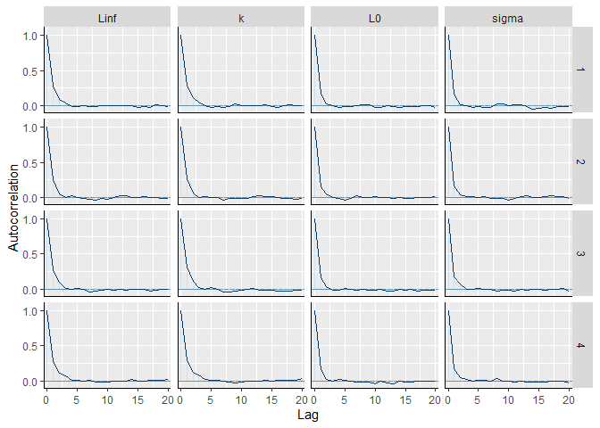<!-- -->

``` r
#Gompertz
modelo_macGom<- Estimate_MCMC_Growth(mac,Model = "Gom" ,iter = 10000,n.chains = 4,BurnIn = 5000,thin = 1,Linf = 1227,Linf.se = 57.83,
                                     L0 = 199.33,L0.se = 14.62,sigma.max = 300,verbose = T,n_cores = 3,k.max = 0.7)
```

    ## 
    ## CHECKING DATA AND PREPROCESSING FOR MODEL 'Gompertz_stan_model' NOW.
    ## 
    ## COMPILING MODEL 'Gompertz_stan_model' NOW.
    ## 
    ## STARTING SAMPLER FOR MODEL 'Gompertz_stan_model' NOW.

``` r
pander(Get_MCMC_parameters(modelo_macGom))
```

| Parameter | mean  | se_mean |  sd   | 2.5%  |  50%  | 97.5% | n_eff | Rhat |
|:---------:|:-----:|:-------:|:-----:|:-----:|:-----:|:-----:|:-----:|:----:|
|   Linf    | 1148  |  0.63   | 62.28 | 1026  | 1148  | 1270  | 9721  |  1   |
|     k     | 0.12  |    0    | 0.01  | 0.09  | 0.12  | 0.15  | 9103  |  1   |
|    L0     | 221.6 |  0.14   | 14.42 |  193  | 221.6 |  250  | 11025 |  1   |
|   sigma   | 146.2 |  0.14   | 14.9  | 120.3 | 145.1 | 178.2 | 11820 |  1   |

``` r
mcmc_combo(modelo_macGom,pars = c("Linf", "k", "L0", "sigma")) #diagnostics
```

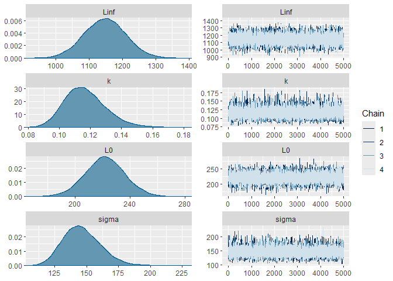<!-- -->

``` r
mcmc_acf(modelo_macGom,pars = c("Linf", "k", "L0", "sigma"))
```

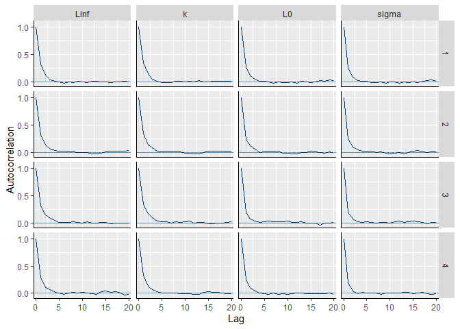<!-- -->

``` r
#Logistic
modelo_macLog<- Estimate_MCMC_Growth(mac,Model = "Log" ,iter = 10000,n.chains = 4,BurnIn = 5000,thin = 1,Linf = 1227,Linf.se = 57.83,
                                     L0 = 199.33,L0.se = 14.62,sigma.max = 300,verbose = T,n_cores = 3,k.max = 0.7)
```

    ## 
    ## CHECKING DATA AND PREPROCESSING FOR MODEL 'Logistic_stan_model' NOW.
    ## 
    ## COMPILING MODEL 'Logistic_stan_model' NOW.
    ## 
    ## STARTING SAMPLER FOR MODEL 'Logistic_stan_model' NOW.

``` r
pander(Get_MCMC_parameters(modelo_macLog))
```

| Parameter | mean  | se_mean |  sd   | 2.5%  |  50%  | 97.5% | n_eff | Rhat |
|:---------:|:-----:|:-------:|:-----:|:-----:|:-----:|:-----:|:-----:|:----:|
|   Linf    | 1121  |  0.64   | 65.08 | 995.3 | 1120  | 1250  | 10209 |  1   |
|     k     | 0.18  |    0    | 0.02  | 0.15  | 0.18  | 0.22  | 9061  |  1   |
|    L0     | 227.7 |  0.14   | 14.35 | 199.4 | 227.8 | 255.5 | 10635 |  1   |
|   sigma   |  158  |  0.16   | 16.91 | 128.9 | 156.8 | 195.6 | 10925 |  1   |

``` r
mcmc_combo(modelo_macLog,pars = c("Linf", "k", "L0", "sigma")) #diagnostics
```

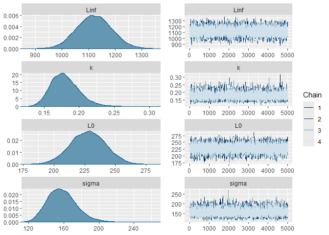<!-- -->

``` r
mcmc_acf(modelo_macLog,pars = c("Linf", "k", "L0", "sigma"))
```

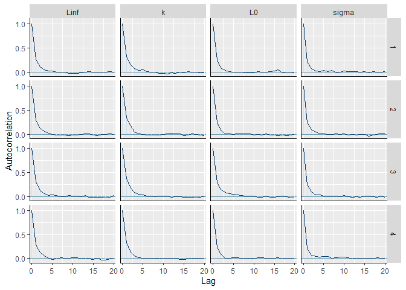<!-- -->

``` r
#Comparative
mac_LooIC <- Compare_Growth_Models(mac,iter = 10000,n.chains = 4,BurnIn = 5000,thin = 1,Linf = 1227,Linf.se = 57.83,
                                     L0 = 199.33,L0.se = 14.62,sigma.max = 300,verbose = T,n_cores = 3,k.max = 0.7)
```

    ## 
    ## CHECKING DATA AND PREPROCESSING FOR MODEL 'VB_stan_model' NOW.
    ## 
    ## COMPILING MODEL 'VB_stan_model' NOW.
    ## 
    ## STARTING SAMPLER FOR MODEL 'VB_stan_model' NOW.
    ## 
    ## CHECKING DATA AND PREPROCESSING FOR MODEL 'Gompertz_stan_model' NOW.
    ## 
    ## COMPILING MODEL 'Gompertz_stan_model' NOW.
    ## 
    ## STARTING SAMPLER FOR MODEL 'Gompertz_stan_model' NOW.
    ## 
    ## CHECKING DATA AND PREPROCESSING FOR MODEL 'Logistic_stan_model' NOW.
    ## 
    ## COMPILING MODEL 'Logistic_stan_model' NOW.
    ## 
    ## STARTING SAMPLER FOR MODEL 'Logistic_stan_model' NOW.

``` r
pander(mac_LooIC) #VB as the best model
```

|  Model   | elpd_diff | se_diff | elpd_loo | se_elpd_loo | p_loo | se_p_loo |
|:--------:|:---------:|:-------:|:--------:|:-----------:|:-----:|:--------:|
|    VB    |     0     |    0    |  -366.8  |    5.917    | 2.279 |  0.5551  |
| Gompertz |  -5.173   | 0.9887  |   -372   |    5.62     | 2.349 |  0.5324  |
| Logistic |  -9.586   |  1.612  |  -376.4  |    5.32     | 2.485 |  0.5156  |

Table continues below

| looic | se_looic | looic_Weight |
|:-----:|:--------:|:------------:|
| 733.6 |  11.83   |     0.99     |
| 743.9 |  11.24   |     0.01     |
| 752.7 |  10.64   |      0       |

## MALE´S PLOTTING

``` r
VBmac<- Calculate_MCMC_growth_curve(modelo_macVB,Model = "VB", max.age = 29, probs = 0.95)
GOMmac<- Calculate_MCMC_growth_curve(modelo_macGom,Model = "Gom", max.age = 29, probs = 0.95)
LOGmac<- Calculate_MCMC_growth_curve(modelo_macLog,Model = "Log", max.age = 29, probs = 0.95)

Modelos_mac <- ggplot() +
  ggtitle("")+
  geom_point( data = mac, aes(x = Age, y = Lenght), shape=1, colour= "black", size= 1,alpha =1 )+
  labs(y = "", x = "")+
  geom_line(data = VBmac, aes(x = Age, y = LAA, linetype= "dotted",color = "Base SE of VB" ),size = 0.8)+
  geom_line(data = GOMmac, aes(x = Age, y = LAA,linetype= "longdashed",color = "Base SE of Gom"),size = 0.8)+
  geom_line(data = LOGmac, aes(x = Age, y = LAA,linetype= "solid",color = "Base SE of Log"),size = 0.8)+
  expand_limits(y = 1230)+
  scale_x_continuous(limits = c(0, 30), breaks = seq(0, 30, by = 5))+
  scale_y_continuous(limits = c(0, 1200), breaks = seq(0, 1200, by = 200))+
  scale_colour_manual(values = c("Black", "Black", "Black"))+
  theme_classic()

Mac_final<-Modelos_mac +  theme(legend.position = "none", panel.border = element_rect(fill=NA))

Mac_final
```

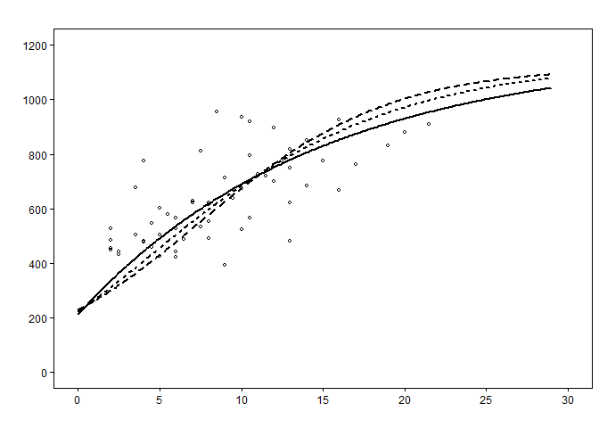<!-- -->

#### FEMALES

## DATA

``` r
hem <- read.table("data/hembras.txt", header = T)
View(hem)

summary(hem)
```

    ##       Age            Lenght    
    ##  Min.   : 1.00   Min.   : 324  
    ##  1st Qu.: 7.50   1st Qu.: 638  
    ##  Median :12.50   Median : 796  
    ##  Mean   :12.74   Mean   : 780  
    ##  3rd Qu.:16.50   3rd Qu.: 930  
    ##  Max.   :28.50   Max.   :1060

``` r
## PRIORS ##

#prior L0
mean(c(190,180,228)) #199.33
```

    ## [1] 199.3333

``` r
seL0<-sd(c(190,180,228))/sqrt(length(c(190,180,228))) #14.62
seL0
```

    ## [1] 14.62114

``` r
#prior Linf
mean(c(1340,1190,1150)) #1227
```

    ## [1] 1226.667

``` r
seLinf<-sd(c(1340,1190,1150))/sqrt(length(c(1340,1190,1150))) #57.83
seLinf
```

    ## [1] 57.83117

``` r
#von Bertalanffy

modelo_hemVB<- Estimate_MCMC_Growth(hem,Model = "VB" ,iter = 10000,n.chains = 4,BurnIn = 5000,thin = 1,Linf = 1227,Linf.se = 57.83,
                                    L0 = 199.33,L0.se = 14.62,sigma.max = 300,verbose = T,n_cores = 3,k.max = 0.7)
```

    ## 
    ## CHECKING DATA AND PREPROCESSING FOR MODEL 'VB_stan_model' NOW.
    ## 
    ## COMPILING MODEL 'VB_stan_model' NOW.
    ## 
    ## STARTING SAMPLER FOR MODEL 'VB_stan_model' NOW.

``` r
pander(Get_MCMC_parameters(modelo_hemVB))
```

| Parameter | mean  | se_mean |  sd   | 2.5%  |  50%  | 97.5% | n_eff | Rhat |
|:---------:|:-----:|:-------:|:-----:|:-----:|:-----:|:-----:|:-----:|:----:|
|   Linf    | 1124  |  0.63   | 52.79 | 1027  | 1122  | 1232  | 7114  |  1   |
|     k     | 0.09  |    0    | 0.01  | 0.07  | 0.09  | 0.11  | 6994  |  1   |
|    L0     | 213.4 |  0.13   | 14.15 | 185.7 | 213.4 | 240.9 | 12144 |  1   |
|   sigma   | 114.3 |  0.08   | 9.05  | 98.13 | 113.8 | 133.6 | 11883 |  1   |

``` r
mcmc_combo(modelo_hemVB,pars = c("Linf", "k", "L0", "sigma")) #diagnostics
```

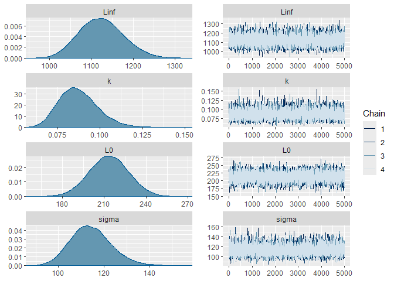<!-- -->

``` r
mcmc_acf(modelo_hemVB,pars = c("Linf", "k", "L0", "sigma"))
```

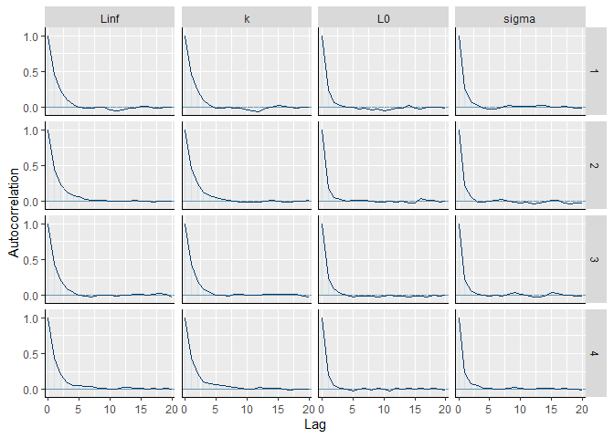<!-- -->

``` r
#Gompertz
modelo_hemGom<- Estimate_MCMC_Growth(hem,Model = "Gom" ,iter = 10000,n.chains = 4,BurnIn = 5000,thin = 1,Linf = 1227,Linf.se = 57.83,
                                    L0 = 199.33,L0.se = 14.62,sigma.max = 300,verbose = T,n_cores = 3,k.max = 0.7)
```

    ## 
    ## CHECKING DATA AND PREPROCESSING FOR MODEL 'Gompertz_stan_model' NOW.
    ## 
    ## COMPILING MODEL 'Gompertz_stan_model' NOW.
    ## 
    ## STARTING SAMPLER FOR MODEL 'Gompertz_stan_model' NOW.

``` r
pander(Get_MCMC_parameters(modelo_hemGom))
```

| Parameter | mean  | se_mean |  sd   | 2.5%  |  50%  | 97.5% | n_eff | Rhat |
|:---------:|:-----:|:-------:|:-----:|:-----:|:-----:|:-----:|:-----:|:----:|
|   Linf    | 1048  |  0.53   | 46.64 | 966.3 | 1045  | 1148  | 7724  |  1   |
|     k     | 0.15  |    0    | 0.02  | 0.12  | 0.15  | 0.19  | 7543  |  1   |
|    L0     | 223.4 |  0.14   | 14.14 | 195.7 | 223.6 | 251.1 | 10830 |  1   |
|   sigma   | 120.7 |   0.1   | 9.99  | 103.3 |  120  |  142  | 10509 |  1   |

``` r
mcmc_combo(modelo_hemGom,pars = c("Linf", "k", "L0", "sigma")) #diagnostics
```

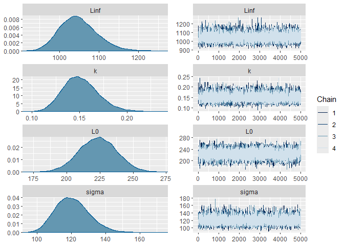<!-- -->

``` r
mcmc_acf(modelo_hemGom,pars = c("Linf", "k", "L0", "sigma"))
```

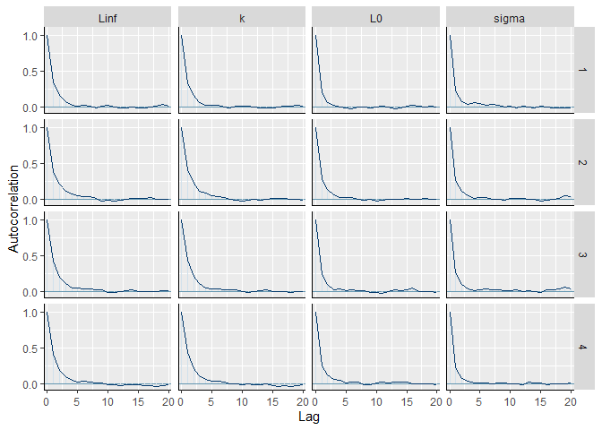<!-- -->

``` r
#Logistic
modelo_hemLog<- Estimate_MCMC_Growth(hem,Model = "Log" ,iter = 10000,n.chains = 4,BurnIn = 5000,thin = 1,Linf = 1227,Linf.se = 57.83,
                                    L0 = 199.33,L0.se = 14.62,sigma.max = 300,verbose = T,n_cores = 3,k.max = 0.7)
```

    ## 
    ## CHECKING DATA AND PREPROCESSING FOR MODEL 'Logistic_stan_model' NOW.
    ## 
    ## COMPILING MODEL 'Logistic_stan_model' NOW.
    ## 
    ## STARTING SAMPLER FOR MODEL 'Logistic_stan_model' NOW.

``` r
pander(Get_MCMC_parameters(modelo_hemLog))
```

| Parameter | mean  | se_mean |  sd   | 2.5%  |  50%  | 97.5% | n_eff | Rhat |
|:---------:|:-----:|:-------:|:-----:|:-----:|:-----:|:-----:|:-----:|:----:|
|   Linf    | 999.4 |  0.43   | 39.62 | 929.7 | 996.4 | 1085  | 8417  |  1   |
|     k     | 0.23  |    0    | 0.03  | 0.18  | 0.23  | 0.29  | 8192  |  1   |
|    L0     | 230.2 |  0.14   | 14.08 | 202.4 | 230.2 | 257.8 | 10671 |  1   |
|   sigma   |  126  |   0.1   | 10.53 | 107.3 | 125.2 | 148.6 | 10786 |  1   |

``` r
mcmc_combo(modelo_hemLog,pars = c("Linf", "k", "L0", "sigma")) #diagnostics
```

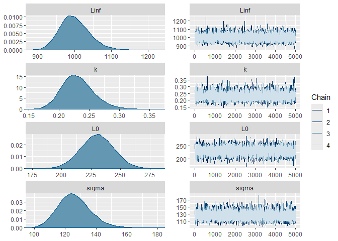<!-- -->

``` r
mcmc_acf(modelo_hemLog,pars = c("Linf", "k", "L0", "sigma"))
```

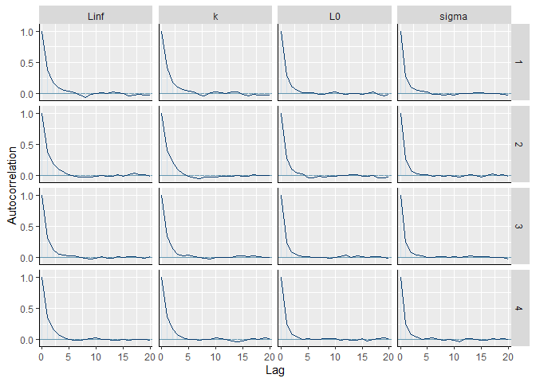<!-- -->

``` r
#Comparative
hem_LooIC <- Compare_Growth_Models(hem,iter = 10000,n.chains = 4,BurnIn = 5000,thin = 1,Linf = 1227,Linf.se = 57.83,
                                    L0 = 199.33,L0.se = 14.62,sigma.max = 300,verbose = T,n_cores = 3,k.max = 0.7)
```

    ## 
    ## CHECKING DATA AND PREPROCESSING FOR MODEL 'VB_stan_model' NOW.
    ## 
    ## COMPILING MODEL 'VB_stan_model' NOW.
    ## 
    ## STARTING SAMPLER FOR MODEL 'VB_stan_model' NOW.
    ## 
    ## CHECKING DATA AND PREPROCESSING FOR MODEL 'Gompertz_stan_model' NOW.
    ## 
    ## COMPILING MODEL 'Gompertz_stan_model' NOW.
    ## 
    ## STARTING SAMPLER FOR MODEL 'Gompertz_stan_model' NOW.
    ## 
    ## CHECKING DATA AND PREPROCESSING FOR MODEL 'Logistic_stan_model' NOW.
    ## 
    ## COMPILING MODEL 'Logistic_stan_model' NOW.
    ## 
    ## STARTING SAMPLER FOR MODEL 'Logistic_stan_model' NOW.

``` r
pander(hem_LooIC) #VB as the best model for females
```

|  Model   | elpd_diff | se_diff | elpd_loo | se_elpd_loo | p_loo | se_p_loo |
|:--------:|:---------:|:-------:|:--------:|:-----------:|:-----:|:--------:|
|    VB    |     0     |    0    |  -548.6  |    6.52     | 2.413 |  0.5109  |
| Gompertz |  -4.917   | 0.9458  |  -553.5  |    6.563    | 2.925 |  0.574   |
| Logistic |   -9.08   |  1.544  |  -557.7  |    6.569    | 3.427 |  0.6724  |

Table continues below

| looic | se_looic | looic_Weight |
|:-----:|:--------:|:------------:|
| 1097  |  13.04   |     0.99     |
| 1107  |  13.13   |     0.01     |
| 1115  |  13.14   |      0       |

## FEMALE´S PLOTTING

``` r
VBhem<- Calculate_MCMC_growth_curve(modelo_hemVB,Model = "VB", max.age = 29, probs = 0.95)
GOMhem<- Calculate_MCMC_growth_curve(modelo_hemGom,Model = "Gom", max.age = 29, probs = 0.95)
LOGhem<- Calculate_MCMC_growth_curve(modelo_hemLog,Model = "Log", max.age = 29, probs = 0.95)

Modelos_hem <- ggplot() +
  ggtitle("")+
  geom_point( data = hem, aes(x = Age, y = Lenght), shape=1, colour= "black", size= 1,alpha =1)+
  labs(y = "Total length (mm)", x = "")+
  geom_line(data = VBhem, aes(x = Age, y = LAA, linetype= "dotted",color = "Base SE of VB" ),size = 0.8)+
  geom_line(data = GOMhem, aes(x = Age, y = LAA,linetype= "longdashed",color = "Base SE of Gom"),size = 0.8)+
  geom_line(data = LOGhem, aes(x = Age, y = LAA,linetype= "solid",color = "Base SE of Log"),size = 0.8)+
  expand_limits(y = 1300)+
  scale_x_continuous(limits = c(0, 30), breaks = seq(0, 30, by = 5))+
  scale_y_continuous(limits = c(0, 1200), breaks = seq(0, 1200, by = 200))+
  theme_classic()

Hem_final<-Modelos_hem +  scale_colour_manual(values = c("Black", "Black", "Black"))+  
          scale_fill_manual(values = c("White", "White", "White")) + 
         theme(legend.position = "none", panel.border = element_rect(fill=NA))

Hem_final
```

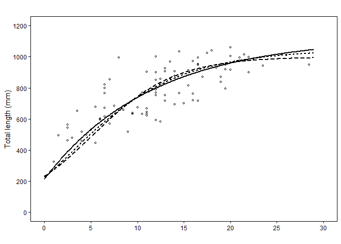<!-- -->

#### COMBINED SEXES

## DATA

``` r
comb <- read.table("data/comb.txt", header = T)

summary(comb)
```

    ##       Age            Length      
    ##  Min.   : 1.00   Min.   : 324.0  
    ##  1st Qu.: 6.50   1st Qu.: 568.5  
    ##  Median :11.00   Median : 720.0  
    ##  Mean   :11.29   Mean   : 725.6  
    ##  3rd Qu.:15.50   3rd Qu.: 900.5  
    ##  Max.   :28.50   Max.   :1060.0

## PRIORS

``` r
#prior L0
mean(c(190,180,228)) #199.33
```

    ## [1] 199.3333

``` r
seL0<-sd(c(190,180,228))/sqrt(length(c(190,180,228))) #14.62
seL0
```

    ## [1] 14.62114

``` r
#prior Linf
mean(c(1340,1190,1150)) #1227
```

    ## [1] 1226.667

``` r
seLinf<-sd(c(1340,1190,1150))/sqrt(length(c(1340,1190,1150))) #57.83
seLinf
```

    ## [1] 57.83117

## COMBINED SEXES

``` r
#von Bertalanffy
modelo_combVB<- Estimate_MCMC_Growth(comb,Model = "VB" ,iter = 10000,n.chains = 4,BurnIn = 5000,thin = 1,Linf = 1227,Linf.se = 57.83,
                                    L0 = 199.33,L0.se = 14.62,sigma.max = 300,verbose = T,n_cores = 3,k.max = 0.7)
```

    ## 
    ## CHECKING DATA AND PREPROCESSING FOR MODEL 'VB_stan_model' NOW.
    ## 
    ## COMPILING MODEL 'VB_stan_model' NOW.
    ## 
    ## STARTING SAMPLER FOR MODEL 'VB_stan_model' NOW.

``` r
pander(Get_MCMC_parameters(modelo_combVB))
```

| Parameter | mean  | se_mean |  sd   | 2.5%  |  50%  | 97.5% | n_eff | Rhat |
|:---------:|:-----:|:-------:|:-----:|:-----:|:-----:|:-----:|:-----:|:----:|
|   Linf    | 1124  |  0.59   | 51.48 | 1028  | 1122  | 1229  | 7519  |  1   |
|     k     | 0.08  |    0    | 0.01  | 0.06  | 0.08  |  0.1  | 7189  |  1   |
|    L0     |  222  |  0.13   | 14.17 | 194.3 |  222  | 249.7 | 11218 |  1   |
|   sigma   | 120.8 |  0.07   | 7.29  | 107.7 | 120.5 | 136.2 | 12082 |  1   |

``` r
mcmc_combo(modelo_combVB,pars = c("Linf", "k", "L0", "sigma")) #diagnostics
```

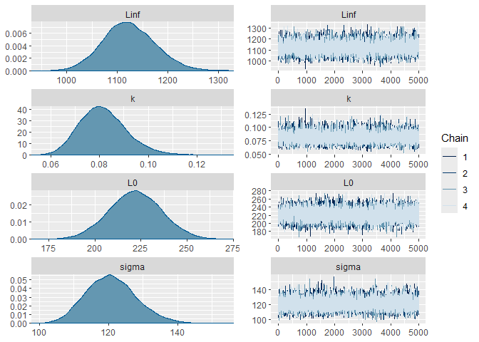<!-- -->

``` r
mcmc_acf(modelo_combVB,pars = c("Linf", "k", "L0", "sigma"))
```

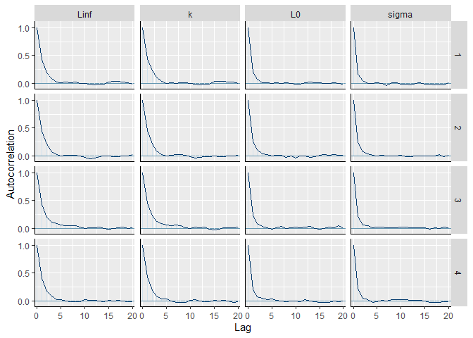<!-- -->

``` r
VBcomb<- Calculate_MCMC_growth_curve(modelo_combVB,Model = "VB", max.age = 29, probs = 0.95)
```

``` r
#Gompertz
modelo_combGom<- Estimate_MCMC_Growth(comb,Model = "Gom" ,iter = 10000,n.chains = 4,BurnIn = 5000,thin = 1,Linf = 1227,Linf.se = 57.83,
                                    L0 = 199.33,L0.se = 14.62,sigma.max = 300,verbose = T,n_cores = 3,k.max = 0.7)
```

    ## 
    ## CHECKING DATA AND PREPROCESSING FOR MODEL 'Gompertz_stan_model' NOW.
    ## 
    ## COMPILING MODEL 'Gompertz_stan_model' NOW.
    ## 
    ## STARTING SAMPLER FOR MODEL 'Gompertz_stan_model' NOW.

``` r
pander(Get_MCMC_parameters(modelo_combGom))
```

| Parameter | mean  | se_mean |  sd   | 2.5%  |  50%  | 97.5% | n_eff | Rhat |
|:---------:|:-----:|:-------:|:-----:|:-----:|:-----:|:-----:|:-----:|:----:|
|   Linf    | 1037  |  0.51   | 44.5  | 957.4 | 1034  | 1132  | 7667  |  1   |
|     k     | 0.14  |    0    | 0.02  | 0.11  | 0.14  | 0.17  | 7446  |  1   |
|    L0     |  237  |  0.14   | 13.88 | 209.9 | 236.9 | 264.1 | 9993  |  1   |
|   sigma   | 125.2 |  0.07   | 7.66  | 111.2 | 124.8 | 141.1 | 12341 |  1   |

``` r
mcmc_combo(modelo_combGom,pars = c("Linf", "k", "L0", "sigma")) #diagnostics
```

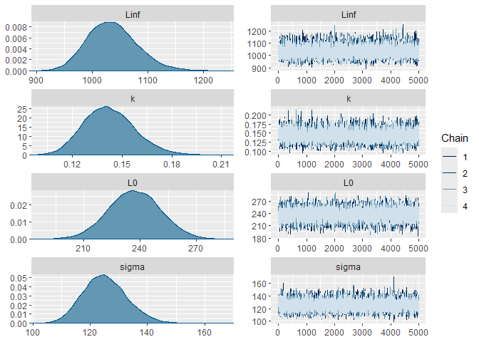<!-- -->

``` r
mcmc_acf(modelo_combGom,pars = c("Linf", "k", "L0", "sigma"))
```

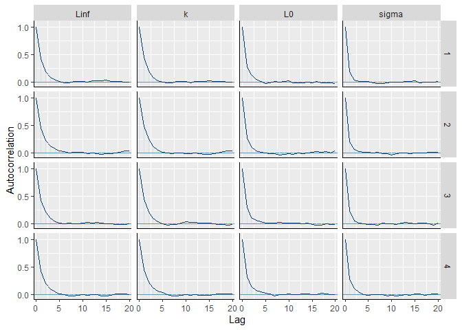<!-- -->

``` r
#Logistic
modelo_combLog<- Estimate_MCMC_Growth(comb,Model = "Log" ,iter = 10000,n.chains = 4,BurnIn = 5000,thin = 1,Linf = 1227,Linf.se = 57.83,
                                    L0 = 199.33,L0.se = 14.62,sigma.max = 300,verbose = T,n_cores = 3,k.max = 0.7)
```

    ## 
    ## CHECKING DATA AND PREPROCESSING FOR MODEL 'Logistic_stan_model' NOW.
    ## 
    ## COMPILING MODEL 'Logistic_stan_model' NOW.
    ## 
    ## STARTING SAMPLER FOR MODEL 'Logistic_stan_model' NOW.

``` r
pander(Get_MCMC_parameters(modelo_combLog))
```

| Parameter | mean  | se_mean |  sd   | 2.5%  |  50%  | 97.5% | n_eff | Rhat |
|:---------:|:-----:|:-------:|:-----:|:-----:|:-----:|:-----:|:-----:|:----:|
|   Linf    | 982.4 |  0.42   | 37.07 | 914.9 | 980.6 | 1061  | 7935  |  1   |
|     k     | 0.22  |    0    | 0.02  | 0.18  | 0.22  | 0.26  | 7737  |  1   |
|    L0     | 245.9 |  0.14   | 13.93 | 218.3 | 245.9 | 273.3 | 9755  |  1   |
|   sigma   | 128.8 |  0.08   | 8.31  | 113.7 | 128.3 | 146.2 | 10887 |  1   |

``` r
mcmc_combo(modelo_combLog,pars = c("Linf", "k", "L0", "sigma")) #diagnostics
```

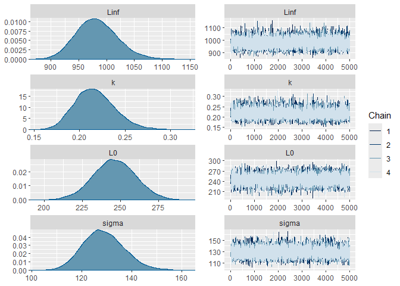<!-- -->

``` r
mcmc_acf(modelo_combLog,pars = c("Linf", "k", "L0", "sigma"))
```

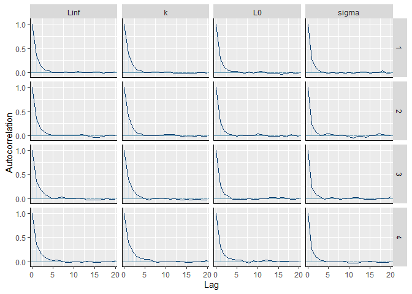<!-- -->

``` r
#Comparative
comb_LooIC <- Compare_Growth_Models(comb,iter = 10000,n.chains = 4,BurnIn = 5000,thin = 1,Linf = 1227,Linf.se = 57.83,
                                    L0 = 199.33,L0.se = 14.62,sigma.max = 300,verbose = T,n_cores = 3,k.max = 0.7)
```

    ## 
    ## CHECKING DATA AND PREPROCESSING FOR MODEL 'VB_stan_model' NOW.
    ## 
    ## COMPILING MODEL 'VB_stan_model' NOW.
    ## 
    ## STARTING SAMPLER FOR MODEL 'VB_stan_model' NOW.
    ## 
    ## CHECKING DATA AND PREPROCESSING FOR MODEL 'Gompertz_stan_model' NOW.
    ## 
    ## COMPILING MODEL 'Gompertz_stan_model' NOW.
    ## 
    ## STARTING SAMPLER FOR MODEL 'Gompertz_stan_model' NOW.
    ## 
    ## CHECKING DATA AND PREPROCESSING FOR MODEL 'Logistic_stan_model' NOW.
    ## 
    ## COMPILING MODEL 'Logistic_stan_model' NOW.
    ## 
    ## STARTING SAMPLER FOR MODEL 'Logistic_stan_model' NOW.

``` r
pander(comb_LooIC) #Vb as the best model
```

|  Model   | elpd_diff | se_diff | elpd_loo | se_elpd_loo | p_loo | se_p_loo |
|:--------:|:---------:|:-------:|:--------:|:-----------:|:-----:|:--------:|
|    VB    |     0     |    0    |   -914   |    8.934    | 2.524 |  0.4228  |
| Gompertz |  -5.379   | 0.9825  |  -919.4  |    8.968    | 3.033 |  0.4789  |
| Logistic |  -9.641   |  1.609  |  -923.6  |    8.985    | 3.408 |  0.5335  |

Table continues below

| looic | se_looic | looic_Weight |
|:-----:|:--------:|:------------:|
| 1828  |  17.87   |      1       |
| 1839  |  17.94   |      0       |
| 1847  |  17.97   |      0       |

\##PLOTTING COMBINED SEXES \##

``` r
VBcomb<- Calculate_MCMC_growth_curve(modelo_combVB,Model = "VB", max.age = 29, probs = 0.95)
GOMcomb<- Calculate_MCMC_growth_curve(modelo_combGom,Model = "Gom", max.age = 29, probs = 0.95)
LOGcomb<- Calculate_MCMC_growth_curve(modelo_combLog,Model = "Log", max.age = 29, probs = 0.95)

Modelos_comb <- ggplot() +
  ggtitle("")+
  geom_point( data = comb, aes(x = Age, y = Length), shape=1, colour= "black", size= 1,alpha =1)+
  labs(y = "", x = "Age (years)")+
  geom_line(data = VBcomb, aes(x = Age, y = LAA, linetype= "dotted",color = "Base SE of VB" ),size = 0.8)+
  geom_line(data = GOMcomb, aes(x = Age, y = LAA,linetype= "longdashed",color = "Base SE of Gom"),size = 0.8)+
  geom_line(data = LOGcomb, aes(x = Age, y = LAA,linetype= "solid",color = "Base SE of Log"),size = 0.8)+
  expand_limits(y = 1300)+
  scale_x_continuous(limits = c(0, 30), breaks = seq(0, 30, by = 5))+
  scale_y_continuous(limits = c(0, 1200), breaks = seq(0, 1200, by = 200))+
  theme_classic()

Comb_final<-Modelos_comb +  scale_colour_manual(values = c("Black", "Black", "Black"))+  
  scale_fill_manual(values = c("White", "White", "White"))+ 
  theme(legend.position = "none", panel.border = element_rect(fill=NA))

Comb_final
```

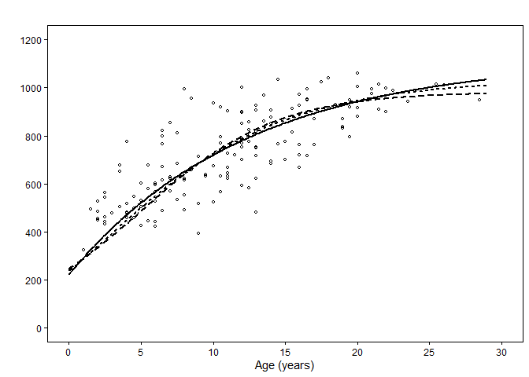<!-- -->

``` r
#Arrange the final position of the plots
library(grid)
library(gridExtra)
library(ggplot2)
library(cowplot)
library(plotrix)

grid.arrange(Mac_final, Hem_final,Comb_final, 
             ncol = 1, nrow = 3)+
  
  theme_set(theme_classic())
```

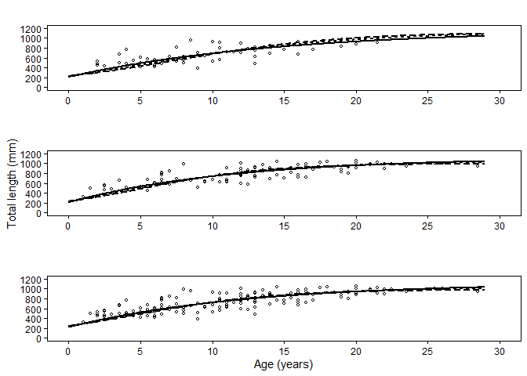<!-- -->

    ## NULL

``` r
ggdraw() +
  draw_plot(Mac_final, x = 0.25, y = .666, width = .5, height = .373) +
  draw_plot(Hem_final, x = 0.25, y = .333, width = .5, height = .373) +
  draw_plot(Comb_final, x = 0.25, y = 0, width = .5, height = .373)+
  draw_plot_label(label = c("Males", "Females", "Combined sexes"), size = 8, fontface = "italic",
                  x = c(0.325, 0.315, 0.285), y = c(0.97, 0.63, 0.3))
```

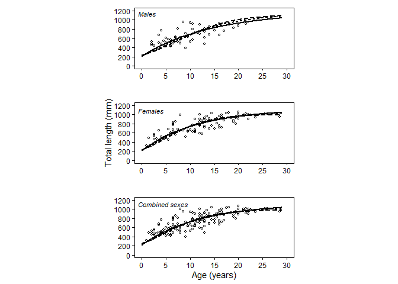<!-- -->
