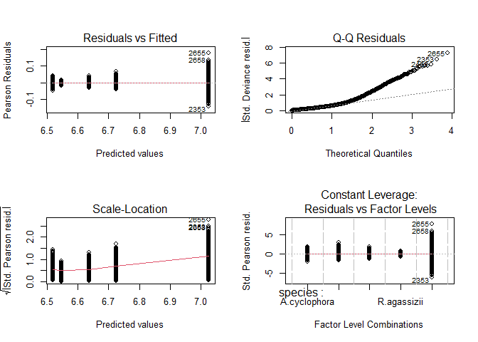
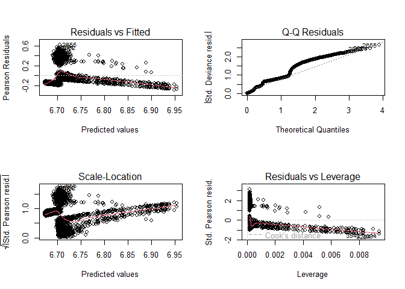
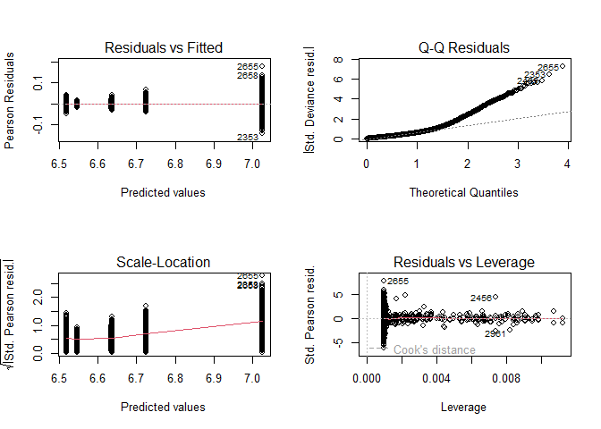
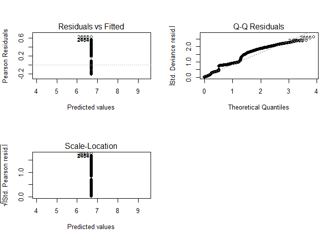
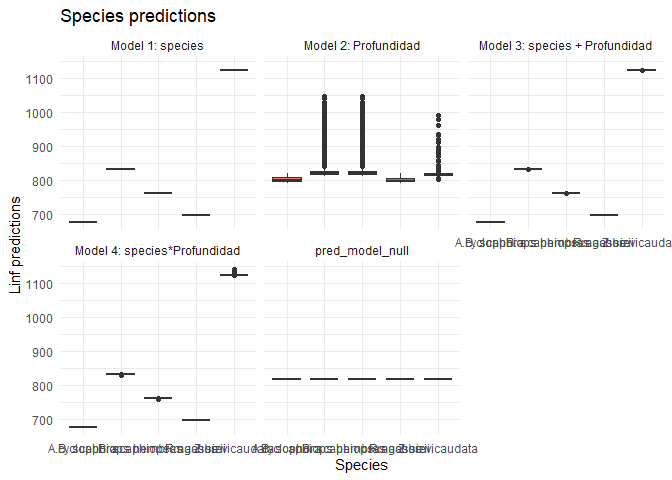
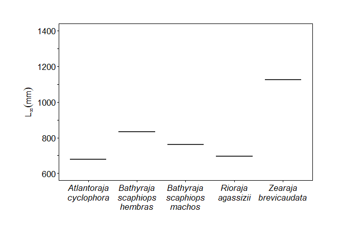
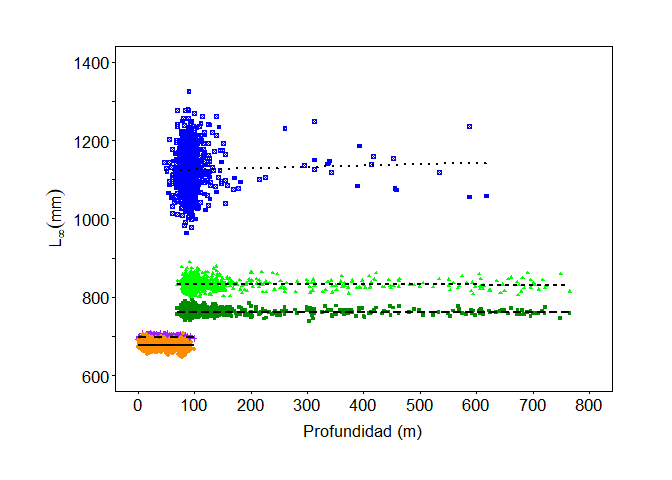

GLMs
================
Santiago Bianchi
2025-12-29

#### GLM with Linf

# Packages

``` r
library(cowplot)
library(readxl)
library(plotrix)
library(readr)
library(MuMIn)
library(ggplot2)
library(dplyr)  # Data manipulation
library(tidyr)  # For pivot_longer()
```

# DATA

``` r
combined_data_1000 <- read.csv("data/combined_data_1000.csv")

str(combined_data_1000)
```

    ## 'data.frame':    5000 obs. of  10 variables:
    ##  $ species    : chr  "R.agassizii" "R.agassizii" "R.agassizii" "R.agassizii" ...
    ##  $ k          : num  0.318 0.326 0.314 0.308 0.321 ...
    ##  $ Linf       : num  694 689 699 692 701 ...
    ##  $ L0         : num  94.3 94.3 94.3 94.3 94.3 ...
    ##  $ LT_max     : int  710 710 710 710 710 710 710 710 710 710 ...
    ##  $ Prof_min   : int  5 5 5 5 5 5 5 5 5 5 ...
    ##  $ Prof_max   : int  150 150 150 150 150 150 150 150 150 150 ...
    ##  $ Rango_prof : int  145 145 145 145 145 145 145 145 145 145 ...
    ##  $ Región     : chr  "Costera" "Costera" "Costera" "Costera" ...
    ##  $ Profundidad: int  78 11 62 15 53 24 52 21 19 33 ...

# GLMs

``` r
# Model 1: Linf ~ especies
model_Linf_1 <- glm(Linf ~ species, data = combined_data_1000, family = Gamma(link = "log"))

summary(model_Linf_1)
```

    ## 
    ## Call:
    ## glm(formula = Linf ~ species, family = Gamma(link = "log"), data = combined_data_1000)
    ## 
    ## Coefficients:
    ##                              Estimate Std. Error t value Pr(>|t|)    
    ## (Intercept)                 6.5185648  0.0007354 8863.88   <2e-16 ***
    ## speciesB. scaphiops hembras 0.2063313  0.0010400  198.39   <2e-16 ***
    ## speciesB. scaphiops machos  0.1176050  0.0010400  113.08   <2e-16 ***
    ## speciesR.agassizii          0.0275269  0.0010400   26.47   <2e-16 ***
    ## speciesZ.brevicaudata       0.5067938  0.0010400  487.29   <2e-16 ***
    ## ---
    ## Signif. codes:  0 '***' 0.001 '**' 0.01 '*' 0.05 '.' 0.1 ' ' 1
    ## 
    ## (Dispersion parameter for Gamma family taken to be 0.0005408248)
    ## 
    ##     Null deviance: 178.8693  on 4999  degrees of freedom
    ## Residual deviance:   2.6933  on 4995  degrees of freedom
    ## AIC: 43469
    ## 
    ## Number of Fisher Scoring iterations: 3

``` r
# Diagnostic plots
par(mfrow = c(2, 2))  # To show 4 plots with 2x2 format
plot(model_Linf_1)
```

<!-- -->

``` r
# Model 2: Linf ~ Profundidad
model_Linf_2<- glm(Linf ~  Profundidad, data = combined_data_1000, family = Gamma(link = "log"))

summary(model_Linf_2)
```

    ## 
    ## Call:
    ## glm(formula = Linf ~ Profundidad, family = Gamma(link = "log"), 
    ##     data = combined_data_1000)
    ## 
    ## Coefficients:
    ##              Estimate Std. Error t value Pr(>|t|)    
    ## (Intercept) 6.673e+00  3.849e-03 1733.57   <2e-16 ***
    ## Profundidad 3.665e-04  2.836e-05   12.92   <2e-16 ***
    ## ---
    ## Signif. codes:  0 '***' 0.001 '**' 0.01 '*' 0.05 '.' 0.1 ' ' 1
    ## 
    ## (Dispersion parameter for Gamma family taken to be 0.03929558)
    ## 
    ##     Null deviance: 178.87  on 4999  degrees of freedom
    ## Residual deviance: 173.05  on 4998  degrees of freedom
    ## AIC: 64306
    ## 
    ## Number of Fisher Scoring iterations: 5

``` r
# Diagnostic plots
par(mfrow = c(2, 2))  # To show 4 plots with 2x2 format
plot(model_Linf_2)
```

<!-- -->

``` r
#Model 3: Linf especies + Profundidad
model_Linf_3<- glm(Linf ~  species + Profundidad, data = combined_data_1000, family = Gamma(link = "log"))

summary(model_Linf_3)
```

    ## 
    ## Call:
    ## glm(formula = Linf ~ species + Profundidad, family = Gamma(link = "log"), 
    ##     data = combined_data_1000)
    ## 
    ## Coefficients:
    ##                               Estimate Std. Error  t value Pr(>|t|)    
    ## (Intercept)                  6.519e+00  7.518e-04 8671.166   <2e-16 ***
    ## speciesB. scaphiops hembras  2.065e-01  1.114e-03  185.395   <2e-16 ***
    ## speciesB. scaphiops machos   1.177e-01  1.114e-03  105.724   <2e-16 ***
    ## speciesR.agassizii           2.752e-02  1.040e-03   26.455   <2e-16 ***
    ## speciesZ.brevicaudata        5.069e-01  1.062e-03  477.356   <2e-16 ***
    ## Profundidad                 -1.281e-06  3.805e-06   -0.337    0.736    
    ## ---
    ## Signif. codes:  0 '***' 0.001 '**' 0.01 '*' 0.05 '.' 0.1 ' ' 1
    ## 
    ## (Dispersion parameter for Gamma family taken to be 0.0005409232)
    ## 
    ##     Null deviance: 178.8693  on 4999  degrees of freedom
    ## Residual deviance:   2.6932  on 4994  degrees of freedom
    ## AIC: 43471
    ## 
    ## Number of Fisher Scoring iterations: 3

``` r
# Diagnostic plots
par(mfrow = c(2, 2))  # To show 4 plots with 2x2 format
plot(model_Linf_3)
```

<!-- -->

``` r
#Model 4: Linf especies*Profundidad
model_Linf_4<- glm(Linf ~ species*Profundidad, data = combined_data_1000, family = Gamma(link = "log"))

summary(model_Linf_4)
```

    ## 
    ## Call:
    ## glm(formula = Linf ~ species * Profundidad, family = Gamma(link = "log"), 
    ##     data = combined_data_1000)
    ## 
    ## Coefficients:
    ##                                           Estimate Std. Error  t value Pr(>|t|)
    ## (Intercept)                              6.519e+00  1.385e-03 4706.385   <2e-16
    ## speciesB. scaphiops hembras              2.063e-01  1.771e-03  116.478   <2e-16
    ## speciesB. scaphiops machos               1.174e-01  1.771e-03   66.274   <2e-16
    ## speciesR.agassizii                       2.641e-02  1.950e-03   13.541   <2e-16
    ## speciesZ.brevicaudata                    5.032e-01  2.130e-03  236.249   <2e-16
    ## Profundidad                             -1.500e-05  2.870e-05   -0.523    0.601
    ## speciesB. scaphiops hembras:Profundidad  1.075e-05  2.925e-05    0.368    0.713
    ## speciesB. scaphiops machos:Profundidad   1.218e-05  2.925e-05    0.416    0.677
    ## speciesR.agassizii:Profundidad           2.891e-05  4.308e-05    0.671    0.502
    ## speciesZ.brevicaudata:Profundidad        4.526e-05  3.232e-05    1.401    0.161
    ##                                            
    ## (Intercept)                             ***
    ## speciesB. scaphiops hembras             ***
    ## speciesB. scaphiops machos              ***
    ## speciesR.agassizii                      ***
    ## speciesZ.brevicaudata                   ***
    ## Profundidad                                
    ## speciesB. scaphiops hembras:Profundidad    
    ## speciesB. scaphiops machos:Profundidad     
    ## speciesR.agassizii:Profundidad             
    ## speciesZ.brevicaudata:Profundidad          
    ## ---
    ## Signif. codes:  0 '***' 0.001 '**' 0.01 '*' 0.05 '.' 0.1 ' ' 1
    ## 
    ## (Dispersion parameter for Gamma family taken to be 0.0005407317)
    ## 
    ##     Null deviance: 178.8693  on 4999  degrees of freedom
    ## Residual deviance:   2.6903  on 4990  degrees of freedom
    ## AIC: 43474
    ## 
    ## Number of Fisher Scoring iterations: 3

``` r
# Diagnostic plots
par(mfrow = c(2, 2))  # To show 4 plots with 2x2 format
plot(model_Linf_3)
```

<!-- -->

``` r
#Null model

model_Linf_null <- glm(Linf ~ 1, data = combined_data_1000, family = Gamma(link = "log"))

summary(model_Linf_null)
```

    ## 
    ## Call:
    ## glm(formula = Linf ~ 1, family = Gamma(link = "log"), data = combined_data_1000)
    ## 
    ## Coefficients:
    ##             Estimate Std. Error t value Pr(>|t|)    
    ## (Intercept) 6.707834   0.002838    2364   <2e-16 ***
    ## ---
    ## Signif. codes:  0 '***' 0.001 '**' 0.01 '*' 0.05 '.' 0.1 ' ' 1
    ## 
    ## (Dispersion parameter for Gamma family taken to be 0.04027291)
    ## 
    ##     Null deviance: 178.87  on 4999  degrees of freedom
    ## Residual deviance: 178.87  on 4999  degrees of freedom
    ## AIC: 64470
    ## 
    ## Number of Fisher Scoring iterations: 4

``` r
# Diagnostics plots for the null model
par(mfrow = c(2, 2))  # To show 4 plots with 2x2 format
plot(model_Linf_null)
```

<!-- -->

# Comparing the candidate models

``` r
# Compare the model using model.sel
model_list <- list( Model_Linf_1 = model_Linf_1, Model_Linf_2 = model_Linf_2, Model_Linf_3 = model_Linf_3,
                    Model_Linf_4 = model_Linf_4, Model_Linf_Null = model_Linf_null)

aic_results <- model.sel(model_list)

aic_results #Model_Linf_1 is the best and Model_Linf_3 has some support
```

    ## Model selection table 
    ##                 (Int) spc        Prf Prf:spc df    logLik    AICc    delta
    ## Model_Linf_1    6.519   +                     6 -21728.55 43469.1     0.00
    ## Model_Linf_3    6.519   + -1.281e-06          7 -21728.49 43471.0     1.89
    ## Model_Linf_4    6.519   + -1.500e-05       + 11 -21725.84 43473.7     4.62
    ## Model_Linf_2    6.673      3.665e-04          3 -32149.88 64305.8 20836.64
    ## Model_Linf_Null 6.708                         2 -32232.99 64470.0 21000.87
    ##                 weight
    ## Model_Linf_1     0.672
    ## Model_Linf_3     0.261
    ## Model_Linf_4     0.067
    ## Model_Linf_2     0.000
    ## Model_Linf_Null  0.000
    ## Models ranked by AICc(x)

``` r
# Model predictions
combined_data_1000$pred_model_1 <- predict(model_Linf_1, type = "response")
combined_data_1000$pred_model_2 <- predict(model_Linf_2, type = "response")
combined_data_1000$pred_model_3 <- predict(model_Linf_3, type = "response")
combined_data_1000$pred_model_4 <- predict(model_Linf_4, type = "response")
combined_data_1000$pred_model_null <- predict(model_Linf_null, type = "response")
```

``` r
# pivot_longer instead gather for big data

predicciones_long <- combined_data_1000 %>%
  select(species, pred_model_1, pred_model_2, pred_model_3, pred_model_4, pred_model_null) %>%
  pivot_longer(cols = starts_with("pred_model"), names_to = "Model", values_to = "Predictions")
```

``` r
# Rename the models for clarity and plotting
predicciones_long$Modelo <- recode(predicciones_long$Model, 
                                   "pred_model_1" = "Model 1: species", 
                                   "pred_model_2" = "Model 2: Profundidad", 
                                   "pred_model_3" = "Model 3: species + Profundidad", 
                                   "pred_model_4" = "Model 4: species*Profundidad", 
                                   "pred_model_nulo" = "Null Model")

# Plotting the predictions
ggplot(predicciones_long, aes(x = species, y = Predictions, fill = species)) +
  geom_boxplot() +
  facet_wrap(~ Modelo) +  # A plot for each model
  labs(title = "Species predictions", 
       x = "Species", 
       y = "Linf predictions") +
  theme_minimal() +
  theme(legend.position = "none")  
```

<!-- -->

``` r
###  GLM 1 PREDICTIONS
combined_data_1000$pred_model_1 <- predict(model_Linf_1, type = "response")

# pivot_longer instead gather for big data
predicciones_long <- combined_data_1000 %>%
  select(species, pred_model_1) %>%
  pivot_longer(cols = starts_with("pred_model"), names_to = "Model", values_to = "Predictions")

# Rename the models for clarity and plotting
predicciones_long$Model <- recode(predicciones_long$Model, 
                                   "pred_model_1" = "Model 1: species")
```

``` r
# Plotting

Profundidad_label<-c("600", "", "800", "", "1000", "", "1200", "", "1400") #labels


Pred_GLM1_Linf<-ggplot(predicciones_long, aes(x = species, y = Predictions, fill = species)) +
  stat_boxplot(geom = "errorbar",
               width = 0.15) + 
  geom_boxplot() +
  ylab(bquote(L[infinity](mm)))+
  xlab("")+
  scale_y_continuous(limits = c(600, 1400), breaks = seq(600, 1400, by = 100), labels = Profundidad_label )+
  scale_x_discrete(labels = c("Atlantoraja\ncyclophora", "Bathyraja\nscaphiops\nhembras",
                              "Bathyraja\nscaphiops\nmachos", "Rioraja\nagassizii", "Zearaja\nbrevicaudata"))+
  theme_classic() +
  theme(legend.position = "none", panel.border = element_rect(fill=NA),
        axis.line = element_line(linewidth = 0.5, colour = "black",linetype = "solid"),
        axis.text.x = element_text(face= "italic", size=13,colour = "black"),                    
        axis.text.y = element_text(size=13,colour = "black"),
        axis.title.x =element_text(size=13,colour = "black", vjust = -1),       
        axis.title.y =element_text(size=rel(1),colour= "black", vjust = 1.5),   
        text = element_text(size=13),                                          
        plot.background = element_rect(color="white", fill="white", linewidth =1),    
        panel.background = element_rect(fill="white"),                         
        plot.margin = margin(t = 35,  # Top margin
                             r = 45,  # Right margin
                             b = 35,  # Bottom margin
                             l = 35)) # Left margin

Pred_GLM1_Linf
```

<!-- -->

``` r
# Model predictions based on the size (eg: total length)
combined_data_1000$pred_model_Linf <- predict(model_Linf_1, type = "response")

# Plotting
Profundidad_label<-c("600", "", "800", "", "1000", "", "1200", "", "1400")

Linfvsprof<-ggplot(combined_data_1000, aes(x = Profundidad, y = Linf, color = species)) +
  geom_point(aes(shape = species), size = 1) +  # Species
  geom_smooth(aes(linetype = species), colour = "black", method = "glm", formula = y ~ x, 
              method.args = list(family = Gamma(link = "log")), se = FALSE) +  # Species lines
  scale_color_manual(values = c(
    "R.agassizii" = "purple",
    "A.cyclophora" = "darkorange",
    "Z.brevicaudata" = "blue",
    "B. scaphiops machos" = "green4",
    "B. scaphiops hembras" = "green"
  ))+
  xlab("Profundidad (m)")+
  ylab(bquote(L[infinity](mm)))+
  scale_y_continuous(limits = c(600, 1400), breaks = seq(600, 1400, by = 100), labels = Profundidad_label )+
  scale_x_continuous(limits = c(0, 800), breaks = seq(0, 800, by = 100))+
  theme_classic() +
  theme(legend.position = "none", panel.border = element_rect(fill=NA),
        axis.line = element_line(linewidth = 0.5, colour = "black",linetype = "solid"),
        axis.text.x = element_text(size=13,colour = "black"),                   
        axis.text.y = element_text(size=13,colour = "black"),
        axis.title.x =element_text(size=13,colour = "black", vjust = -1),       
        axis.title.y =element_text(size=rel(1),colour= "black", vjust = 1.5),    
        text = element_text(size=13),                                           
        plot.background = element_rect(color="white", fill="white", linewidth =1),   
        panel.background = element_rect(fill="white"),                         
        plot.margin = margin(t = 35,  # Top margin
                             r = 45,  # Right margin
                             b = 35,  # Bottom margin
                             l = 35)) # Left margin
Linfvsprof
```

<!-- -->

``` r
# Profundidad average values
promedios_profundidad <- combined_data_1000 %>%
  group_by(species) %>%
  summarize(promedio_Profundidad = mean(Profundidad, na.rm = TRUE))

print(promedios_profundidad)
```

    ## # A tibble: 5 × 2
    ##   species              promedio_Profundidad
    ##   <chr>                               <dbl>
    ## 1 A.cyclophora                         40.9
    ## 2 B. scaphiops hembras                146. 
    ## 3 B. scaphiops machos                 146. 
    ## 4 R.agassizii                          36.1
    ## 5 Z.brevicaudata                       97.0

``` r
# Min an max profundidad values
rangos_profundidad <- combined_data_1000 %>%
  group_by(species) %>%
  summarize(min_Profundidad = min(Profundidad, na.rm = TRUE),
            max_Profundidad = max(Profundidad, na.rm = TRUE))

print(rangos_profundidad)
```

    ## # A tibble: 5 × 3
    ##   species              min_Profundidad max_Profundidad
    ##   <chr>                          <int>           <int>
    ## 1 A.cyclophora                       1             100
    ## 2 B. scaphiops hembras              69             765
    ## 3 B. scaphiops machos               69             765
    ## 4 R.agassizii                        0              99
    ## 5 Z.brevicaudata                    46             617
